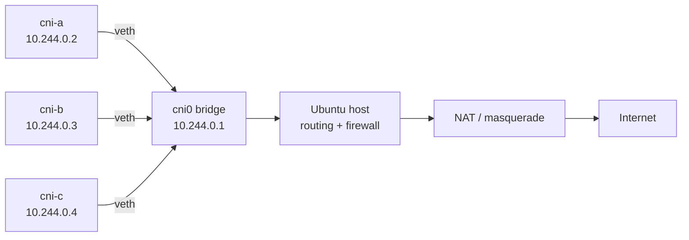

# Tiny CNI

[](https://github.com/PatienceEnoch/tiny-cni/actions/workflows/tests.yml)

Build the network a container would need, one Linux command at a time.

**CNI stands for Container Network Interface**: a standard for how container runtimes ask plugins to configure networking. Tiny CNI is a learning project that builds the underlying pieces... isolated network environments, virtual cables, a virtual switch, and IP addresses, all in Python. Implementing the standard CNI plugin interface is a future step.

## Architecture



## Proof it works

- **24 automated tests** cover validation, deterministic interface naming, IP allocation, and endpoint health checks.
- **GitHub Actions CI** runs Ruff and pytest on every push and pull request.
- A Tiny CNI endpoint has resolved DNS, reached the public internet, and completed a real HTTPS request returning **HTTP/2 200**.
- The `check` command reports namespace, IPv4, gateway, bridge, DNS, internet, and overall health in one command.

## What it does

One command creates a network namespace, connects it to a shared Linux bridge, assigns an IPv4 address, and sets a default route and DNS configuration.

The script includes:

- **IPAM (IP Address Management):** chooses an available address by checking Ubuntu and its named network namespaces, or accepts an address you supply.
- Validation that rejects invalid names, addresses outside the subnet, reserved addresses, and addresses already found in use.
- A shared file lock so this script's commands take turns.
- Rollback that attempts to remove newly created endpoint resources if setup fails.
- A delete command for removing an endpoint and its DNS configuration.
- A `list` command showing interfaces and IPv4 addresses across all named namespaces, including manually created ones.
- A `setup` command that discovers the outgoing interface, enables IPv4 forwarding, and adds missing firewall and NAT rules.
- A `check` command that reports namespace, IPv4, gateway, bridge, DNS, and internet health for an endpoint.
- Automated pytest coverage for validation, IP allocation, interface naming, and endpoint health checks.
- GitHub Actions CI that runs Ruff linting and the test suite automatically on pushes and pull requests.

## Try it

Use a Linux lab machine with Python 3.8 or newer, `ip` from iproute2, `iptables`, and `sysctl`. The examples also use `ping`. Run the commands from the repository directory with root privileges.

Configure the host for endpoint internet access:

```bash
sudo python3 src/tiny_cni.py setup
```

`setup` expects exactly one IPv4 default route with an outgoing interface. It enables forwarding, allows traffic from `cni0` through that interface, allows established and related traffic back, and configures **NAT (Network Address Translation)** with masquerading. It uses `DOCKER-USER` when that chain exists, otherwise `FORWARD`; using `DOCKER-USER` assumes the host's forwarding rules jump to that chain, as they do in the development lab.

Each rule is checked before insertion. Repeating setup with the same outgoing interface does not add duplicate matching rules. This is **idempotence**: repeating an operation leaves the intended configuration in the same state. Setup configures the host; `add` creates the bridge and endpoints.

Create an endpoint and let the script choose its address:

```bash
sudo python3 src/tiny_cni.py add demo-a
```

Or request a specific unused address:

```bash
sudo python3 src/tiny_cni.py add demo-b 10.244.0.20/24
```

List all named namespaces and their non-loopback interfaces and IPv4 addresses:

```bash
sudo python3 src/tiny_cni.py list
```

This includes namespaces created outside Tiny CNI. Listing an endpoint does not prove it has connectivity.

Run a health check on an endpoint:

```bash
sudo python3 src/tiny_cni.py check demo-a
```

`check` verifies that the namespace exists, finds its IPv4 address, checks its default gateway and the `cni0` bridge, then tests DNS resolution and internet reachability.

You can also inspect the endpoint directly and test its connection to the bridge gateway:

```bash
sudo ip netns exec demo-a ip -br addr
sudo ip netns exec demo-a ping -c 3 10.244.0.1
```

Here, `ip netns exec demo-a` means “run the following command inside demo-a's network environment.”

Remove the demo endpoints when finished:

```bash
sudo python3 src/tiny_cni.py del demo-a
sudo python3 src/tiny_cni.py del demo-b
```

## Know the addresses

| Role | Value |
|---|---|
| Endpoint subnet | `10.244.0.0/24` |
| Shared virtual switch | `cni0` |
| Bridge gateway address | `10.244.0.1` |
| Endpoint address pool | `10.244.0.2` through `10.244.0.254` |
| Network interface inside each script-created namespace | `eth0` |
| Configured public DNS server | `1.1.1.1` |

`setup` configures host forwarding, firewall rules, and NAT. The host still needs a working upstream connection. Writing a DNS configuration alone does not make that server reachable.

## Terms in plain language

| Term | Meaning |
|---|---|
| **Container runtime** | Software that starts and manages containers. |
| **CNI: Container Network Interface** | A standard through which a container runtime asks networking plugins to connect or disconnect containers. |
| **Network namespace** | An isolated network environment inside Linux, with its own interfaces, addresses, and routes. It supplies network isolation; it is not a complete container. |
| **Endpoint** | One network attachment. In this project, a namespace with its configured interface and address. |
| **Veth: virtual Ethernet pair** | Two connected virtual interfaces that work like the ends of a network cable. |
| **Bridge** | A virtual network switch that connects the endpoints. |
| **IP: Internet Protocol** | The protocol used to address and route packets between networks. An IP address identifies an interface for that communication. |
| **Subnet** | A range of addresses belonging to one network. Here, `/24` means the first 24 bits identify the network. |
| **Gateway** | The next router an endpoint sends traffic to when the destination is outside its local network. |
| **Default route** | The route used when no more specific route matches a destination. |
| **IPAM: IP Address Management** | Choosing and tracking addresses to avoid conflicts. Tiny CNI currently checks live assignments rather than keeping a persistent allocation database. |
| **DNS: Domain Name System** | Resolves names such as `example.com` to IP addresses. |
| **NAT: Network Address Translation** | Rewrites addresses as traffic crosses a router, often allowing private addresses to share an outward-facing address. |
| **Forwarding** | Passing packets between network interfaces so the host can act as a router. |
| **Connection tracking (conntrack)** | Keeping track of traffic flows so firewall rules can recognize replies and related traffic. |
| **Masquerading** | A form of source NAT that uses the outgoing interface's address. |
| **Idempotence** | Repeating an operation without accumulating duplicate changes. |
| **ARP: Address Resolution Protocol** | Finds the MAC address associated with a nearby IPv4 address. |
| **MAC: Media Access Control address** | An address used to deliver Ethernet frames on a local network. |
| **FDB: Forwarding Database** | The bridge's table mapping learned MAC addresses to ports or interfaces. |
| **ICMP: Internet Control Message Protocol** | Carries network control messages; ping uses echo requests and replies. |
| **TCP: Transmission Control Protocol** | Provides reliable, ordered delivery over a connection. |
| **HTTP: Hypertext Transfer Protocol** | The request-and-response protocol used by web clients and servers. |
| **HTTPS: HTTP over TLS** | HTTP protected by Transport Layer Security, which encrypts the connection. |
| **SYN / ACK / FIN** | TCP flags meaning synchronize, acknowledgment, and finish. They help establish, acknowledge, and close connections. |
| **Lock** | Makes cooperating commands wait their turn before changing shared resources. |
| **Rollback** | Undoes completed setup steps after a later step fails. |

## Checked in the development lab

- 24 automated pytest cases pass locally and through GitHub Actions CI.
- The `check` command reports healthy namespace, IPv4, gateway, bridge, DNS, and internet status for `cni-a`.
- HTTPS application traffic from `cni-d` to `https://example.com` returned `HTTP/2 200`.
- Gateway reachability, internet reachability by IP, and DNS resolution from an endpoint.
- Communication between two namespaces through the bridge.
- Automatic address selection and rejection of duplicate or reserved addresses.
- A command waiting for the shared lock, then continuing after release.
- Namespace and virtual-cable cleanup after a deliberately injected endpoint-creation failure.
- Reuse of an address after its previous endpoint was deleted.
- Listing all six lab namespaces, including two created manually.
- Host setup detecting the outgoing interface and recognizing all three pre-existing rules without adding duplicates.

The host setup check exercised existing-rule detection; installing missing rules on a fresh host has not yet been verified in this lab.

The injected failure occurred before DNS setup, so that test did not verify cleanup after a DNS-file write failure.

## Development

Create an isolated Python environment and install the development tools:

```bash
python3 -m venv .venv
source .venv/bin/activate
python -m pip install pytest ruff
```

Run the same checks used by CI:

```bash
ruff check .
pytest -q
```

Pytest and Ruff configuration lives in `pyproject.toml`.

## Current boundaries

This is a single-host learning tool. Address discovery covers the host and its named namespaces; it does not discover every device on an external network. The lock coordinates commands using the same lock file, not unrelated networking tools.

The shared bridge and host setup rules remain after endpoint deletion or endpoint rollback. `setup` does not roll back partial host configuration if a later setup step fails, and it does not remove rules for an old outgoing interface if the default route changes.

Forwarding and firewall changes apply to the running system; this script does not persist them across reboot. Rerun `setup` and recreate endpoints after reboot. Per-namespace DNS directories under `/etc/netns` can survive reboot, and `add` refuses to overwrite them. For a previously created endpoint, use `del NAME` to clean its leftover configuration before recreating it.

The script currently has no persistent allocation database or standard CNI runtime integration.

## Packet walkthroughs: September 22, 2026

These observations come from an interactive Ubuntu lab session. They are manual demonstrations, not an automated test suite. Packet details below were copied or summarized from terminal output; no packet capture files were saved in the repository.

| Demonstration | Observed result |
|---|---|
| Local web request | Client `cni-d` reached a Python HTTP server on `cni-c`, port 8000, and received `200 OK`. |
| ICMP on the bridge | Three echo requests from `cni-d` and three replies from `cni-c`. |
| NAT on the host | Outbound source changed from endpoint `10.244.0.5` to Ubuntu uplink `10.10.10.10`. Returning traffic was translated back to the endpoint. This captures one NAT step, not upstream translation. |
| Local vs. external routes | The neighbor was reached directly through `eth0`; Cloudflare `1.1.1.1` used gateway `10.244.0.1`. |
| ARP exchange | `cni-d` asked who owned `10.244.0.4`, and `cni-c` replied with its MAC address. A reverse neighbor check followed. |
| Bridge learning | After a ping, the FDB contained both endpoint MAC addresses on their respective host-side veth interfaces. |
| Missing default route | Removing only `cni-d`'s default route left local ping working but caused internet ping to report “Network is unreachable.” Replies returned after restoring the route. |
| DNS exchange | One IPv4 lookup for `example.com` and a reply containing two addresses, about 34 milliseconds later. |
| Encrypted web request | `curl -I https://example.com` from `cni-d` returned `HTTP/2 200`. |
| TCP lifecycle | Captured SYN, SYN-ACK, ACK; a 79-byte HTTP request; 156 bytes of response headers; and orderly connection closure. |

The client was `cni-d (10.244.0.5)`; the local server was `cni-c (10.244.0.4)`. Their host-side virtual cable interfaces were `tc-f61fd4-h` and `tc-dee853-h`, respectively.

### Current milestone

Tiny CNI now has working endpoint creation and deletion, automatic IPv4 allocation, bridge networking, host forwarding and NAT setup, DNS configuration, endpoint listing, and an endpoint health-check command.

The development lab has verified local namespace-to-namespace traffic, internet reachability by IP, DNS resolution, HTTPS traffic, route-failure behavior, ARP, bridge learning, NAT, and the TCP connection lifecycle. The Python logic is covered by 24 automated tests, and the same test suite runs automatically in GitHub Actions.

### Next work

1. Add optional machine-readable output to `check` for automation.
2. Expand automated coverage around deletion, rollback, DNS cleanup, and host setup.
3. Verify `setup` on a fresh host where the firewall and NAT rules do not already exist.
4. Consider persistent IP allocation state instead of relying only on live address discovery.
5. Treat standard CNI runtime integration as a separate phase.

After a reboot, rerun `setup` and recreate endpoints as needed; Git preserves the code and documentation, not live namespaces or virtual links.

